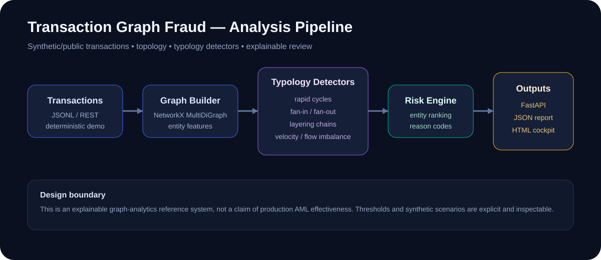
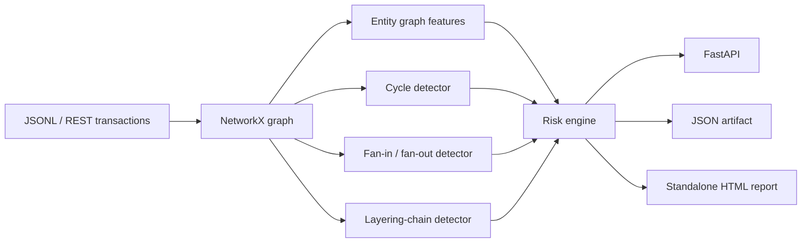

# Transaction Graph Fraud



A runnable graph-analytics project for detecting suspicious transaction structures using **explicit, explainable network patterns** rather than a black-box score alone.

The public project uses deterministic synthetic data. It is designed to demonstrate graph engineering, financial-crime analytics, service boundaries and reviewer-facing evidence without containing real customer or employer data.

## What it detects

- **rapid fund cycles** such as `A → B → C → A`;
- **fan-in / fan-out** concentration patterns;
- **rapid layering chains** that preserve similar amounts across multiple hops;
- high transaction velocity and unusual inbound/outbound imbalance;
- graph features including degree, counterparty count, PageRank and clustering;
- ranked entity risk with human-readable reason codes.

The detectors intentionally expose their thresholds and evidence. This is a portfolio/reference system, not a claim that these heuristics are sufficient for a production AML program.

## Architecture



## Quick start

```bash
python -m venv .venv
source .venv/bin/activate  # Windows: .venv\Scripts\activate
pip install -r requirements.txt
python -m graphfraud.cli --seed 42
```

This creates:

```text
artifacts/analysis.json
artifacts/report.html
```

Run the API:

```bash
uvicorn app.api:app --reload
```

Then:

```bash
curl http://localhost:8000/demo
```

or send your own synthetic/public transaction set to `POST /analyze`.

## Synthetic scenarios

`graphfraud/synthetic.py` generates ordinary background activity plus labeled-by-construction structures for engineering tests:

```text
risk_cycle_a -> risk_cycle_b -> risk_cycle_c -> risk_cycle_a

sender_0 --\
sender_1 ---\
...          > risk_mule -> offramp
sender_6 ---/

layer_a -> layer_b -> layer_c -> layer_d -> layer_e
```

These scenarios let CI verify that the graph pipeline still finds the expected *types* of structure after refactors.

## Package structure

```text
graphfraud/
  domain.py       transaction, finding and entity-risk models
  features.py     graph construction and entity-level features
  detectors.py    cycle, fan and layering typology detectors
  engine.py       finding aggregation and risk ranking
  synthetic.py    deterministic synthetic scenarios
  report.py       standalone HTML reviewer report
  cli.py          reproducible command-line run
app/
  api.py           FastAPI boundary
tests/
  test_graphfraud.py
```

## Engineering choices

**MultiDiGraph instead of a single weighted edge.** Multiple transfers between the same pair retain their own transaction IDs and timestamps, which matters when a finding must point back to evidence.

**Pattern findings stay separate from the entity score.** A reviewer can see *why* an entity was raised rather than receiving only one opaque probability.

**Deterministic synthetic cases.** They make tests reproducible and keep the public repository free of confidential datasets.

**Human review is the intended consumer.** Scores rank and summarize cases; they are not presented as autonomous enforcement decisions.

## Docker

```bash
docker build -t transaction-graph-fraud .
docker run --rm -p 8000:8000 transaction-graph-fraud
```

## Tests and CI

```bash
ruff check .
pytest -q
```

GitHub Actions runs linting, tests, a complete CLI demo and a container build.

## Portfolio signal

This project is meant to make the following skills inspectable in one place:

**Python · NetworkX · graph analytics · financial crime patterns · explainability · FastAPI · Docker · CI/CD · synthetic data generation · human-review-oriented system design**
